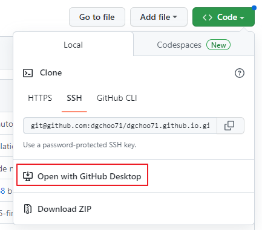

# 참고 영상
https://youtu.be/ACzFIAOsfpM

# 생성 순서
1. [jekyll-theme 사이트](https://github.com/topics/jekyll-theme)에서 마음에 드는 테마를 선택하고 clone을 수행   
clone을 할 때 사이트의 이름을 변경한다. (예, dgchoo71.github.io)
2. _config.yml 파일에서 url을 수정한다.
3. 새로운 포스팅을 생성한다.    
포스팅을 할 때 폴더의 이름은 _posts 이어야 한다.   
[jekyll 문서 사이트](https://jekyllrb.com/docs/posts/)를 참고
4. 새로운 파일의 헤더는 다음과 같다.   
```
---
layout: post
title:  "포스팅의 제목"
---
```

5. 포스팅의 문서 이름은 _posts/year-month-day-*title*.md 형식을 사용한다.   
예) 2023-01-25-first.md

6. 커밋을 해야 블로그 사이트에 변경 사항이 반영된다.
7. 또는 jupyter 파일을 바로 업로드할 수 있다. 이 때, 파일 이름 규칙을 준수해야 한다. (yyyy-mm-dd-*title*.md)

Github 사이트에서 직접 파일을 수정하는 것보다는 local에서 작업하도록 하는 것이 편리하다. 
* GitHub Desktop 이용하는 것을 권장   
 

